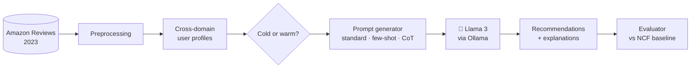

<div align="center">

# 🦙 LLAMAREC

### Cross-Domain Recommendations with Local Large Language Models

*Recommend a film from someone's bookshelf. Recommend an album from their watchlist.*<br>
*All of it running on your own machine, with an explanation for every pick.*

<br>


**MSc Artificial Intelligence Dissertation · De Montfort University · 2025**

[Overview](#-overview) · [How It Works](#-how-it-works) · [Quick Start](#-quick-start) · [Usage](#-usage) · [Evaluation](#-evaluation) · [Results](#-results) · [Citation](#-citation)

</div>

---

## 📖 Overview

Most recommendation systems stay inside one category. If you have rated a hundred books, a typical system can suggest more books, but it has very little to say about which films you might enjoy.

LLAMAREC tries to close that gap. It gives a Llama 3 model a user's ratings in one domain, asks it to work out what the person actually likes, and then has it recommend items from a different domain. The model also explains why each item made the list.

Everything runs locally through [Ollama](https://ollama.com/), so user data never leaves the machine.

<table>
<tr>
<td width="50%" valign="top">

### 🔀 Cross-domain transfer
Moves preferences between **Books**, **Movies & TV**, **Music** and **CDs**.

### 🔒 Private by design
Llama 3 runs locally through Ollama. No user history is sent to an external API.

### 💬 Explainable picks
Every recommendation comes with a short, readable reason linked to the user's history.

</td>
<td width="50%" valign="top">

### 🧊 Cold vs warm users
Compares **cold** users (fewer than 50 interactions) with **warm** users (more than 200).

### 🧠 Three prompt strategies
Standard, few-shot and chain-of-thought prompting, each combined with retrieval.

### 📊 Proper evaluation
Precision@K, Recall@K, NDCG, diversity, novelty and coverage, compared against NCF and content-based baselines.

</td>
</tr>
</table>

---

## ⚙️ How It Works



1. **Collect.** Amazon review data is cleaned and converted to CSV.
2. **Profile.** Users who rated items in more than one domain are identified and split into cold and warm groups.
3. **Prompt.** The user's highly rated items in the source domain are placed into one of three prompt templates.
4. **Generate.** A local Llama 3 model returns three recommendations for the target domain, each with a reason.
5. **Evaluate.** Results are scored on ranking quality, diversity and novelty, then compared with traditional baselines.

---

## 🗂️ Project Structure

<details>
<summary><b>Click to expand the folder layout</b></summary>

<br>

```
llamarec/
├── data/
│   ├── amazon_raw/                       # Raw Amazon review files go here
│   ├── processed/                        # CSVs created by amazon_collector
│   └── splits/                           # Cross-domain, cold, warm, train and test splits
├── models/
│   └── neural_cf.py                      # Neural Collaborative Filtering
├── preprocessing/
│   ├── amazon_collector.py               # Loads and cleans the Amazon data
│   ├── domain_preprocessor.py            # Finds users active in several domains
│   └── data_splitter.py                  # Builds the data splits
├── prompts/
│   ├── prompt_generator.py               # Builds recommendation prompts
│   └── prompt_templates.py               # Standard, few-shot and CoT templates
├── runners/
│   ├── run_ollama_llamarec.py            # Main LLAMAREC runner
│   ├── run_cold_warm_scenarios.py        # Cold vs warm experiments
│   └── evaluation_runner.py              # Automated evaluation
├── testers/
│   ├── interactive_llamarec_tester.py    # Interactive demo
│   ├── run_enhanced_llamarec.py          # Extended testing
│   └── test_prompt_generator_cold_warm.py
├── utils/
│   ├── llm_utils.py                      # Talking to Ollama
│   ├── file_utils.py
│   ├── performance_utils.py
│   ├── logging_utils.py
│   └── metrics.py                        # Evaluation metrics
├── evaluations/
│   └── quantitative_evaluator.py         # Main evaluation system
├── baselines/
│   ├── neural_cf.py                      # NCF baseline
│   └── ncf_evaluation_runner.py
└── README.md
```

</details>

---

## 🚀 Quick Start

### Requirements

| | Minimum | Recommended |
|---|---|---|
| **Python** | 3.8 | 3.10+ |
| **RAM** | 8 GB | 16 GB for full datasets |
| **Storage** | About 100 GB for processed data | |
| **CPU** | Multi-core | Multi-core (parallel processing is supported) |
| **LLM runtime** | [Ollama](https://ollama.com/) | |

> 💡 The dataset is the [Amazon Reviews 2023](https://huggingface.co/datasets/McAuley-Lab/Amazon-Reviews-2023) collection from McAuley Lab on Hugging Face. Most of the experiments used [`llama3.1:8b`](https://ollama.com/library/llama3.1:8b).

### 1 · Install

```bash
git clone https://github.com/ThanigaiSingaravelan/llamrec.git
cd llamrec

python -m venv venv
source venv/bin/activate        # Windows: venv\Scripts\activate

pip install -r requirements.txt
```

### 2 · Set up Ollama

```bash
ollama pull llama3:8b
ollama pull llama3:70b          # optional, for comparison
ollama serve
```

Then check the connection:

```bash
python ollama_api.py
```

### 3 · Prepare the data

Download the Amazon review files (Books, Movies & TV, CDs, Digital Music) and place them in `data/raw/`.

```bash
# Clean and convert the raw files
python preprocessing/amazon_collector.py --base_path data/raw --output_dir data/processed

# Build cross-domain user profiles
python preprocessing/domain_preprocessor.py --base_path data/processed --output_path data/splits

# Create the splits
python preprocessing/data_splitter.py --input_path data/splits --output_path data/splits
```

### 4 · Run it

```bash
# Try it interactively
python testers/interactive_llamarec_tester.py

# Cold vs warm comparison
python runners/run_cold_warm_scenarios.py --mode comparative

# Standard run
python runners/run_ollama_llamarec.py
```

### 5 · Evaluate

```bash
python runners/evaluation_runner.py

python baselines/ncf_evaluation_runner.py \
    --dataset data/splits/Books_filtered.csv \
    --user_history data/splits/user_history.json \
    --domain Books
```

---

## 💻 Usage

### Recommend films from a reading history

```python
from testers.interactive_llamarec_tester import InteractiveLlamaRecTester

tester = InteractiveLlamaRecTester(
    user_history_path="data/splits/user_history.json",
    ollama_model="llama3:8b",
)

rec = tester.generate_recommendation(
    user_id="A1B2C3D4E5",
    source_domain="Books",
    target_domain="Movies_and_TV",
    num_recs=3,
)

print(rec["recommendations"])
```

### Compare cold and warm users

```python
from runners.run_cold_warm_scenarios import ColdWarmScenarioRunner
from testers.test_prompt_generator_cold_warm import PromptGeneratorTester

base_tester = PromptGeneratorTester(splits_dir="data/splits")
runner = ColdWarmScenarioRunner(base_tester)

results = runner.run_comparative_study(
    max_users_per_scenario=20,
    temperature=0.7,
)
```

### Score the results

```python
from evaluations.quantitative_evaluator import RecommendationEvaluator

evaluator = RecommendationEvaluator("data/splits/user_history.json")

results = evaluator.evaluate_recommendations("results/llamarec_results.json", k=3)
evaluator.generate_evaluation_report(results, "evaluation_report.txt")
```

<details>
<summary><b>Model configuration</b></summary>

<br>

```python
model_configs = {
    "base_model": {
        "model_name": "llama3:8b",
        "temperature": 0.7,
        "max_tokens": 512,
    },
    "large_model": {
        "model_name": "llama3:70b",
        "temperature": 0.7,
        "max_tokens": 512,
    },
}
```

</details>

<details>
<summary><b>Prompt templates</b></summary>

<br>

**Standard**

```text
Based on the user's preferences in {source_domain}, generate personalised
recommendations for items from {target_domain}.

User's highly-rated items: {user_history}
Target domain: {target_domain}

Recommend top 3 items with explanations.
```

**Chain-of-thought**

```text
You are an expert recommendation system. Analyse the user's preferences step-by-step.

Step 1: Analyse patterns in user's {source_domain} preferences: {user_history}
Step 2: Identify transferable preferences to {target_domain}
Step 3: Recommend 3 {target_domain} items that match these patterns

Provide detailed reasoning for each recommendation.
```

</details>

<details>
<summary><b>Experimental design and statistics</b></summary>

<br>

```python
from experiments.advanced_experimental_designs import (
    AdvancedExperimentalDesigner,
    ExperimentalStatistics,
)

designer = AdvancedExperimentalDesigner(base_tester)

# Temperature × user type × domain × template
factorial_results = designer.run_full_experiment_suite("factorial")

# How much each component contributes
ablation_results = designer.run_full_experiment_suite("ablation")

stats = ExperimentalStatistics()
effect_size = stats.compute_effect_size(group1_scores, group2_scores)
required_n = stats.power_analysis(effect_size=0.5, power=0.8)
```

</details>

---

## 📏 Evaluation

| Category | Metric | What it tells you |
|---|---|---|
| **Ranking** | Precision@K | How many of the top K picks were relevant |
| | Recall@K | How many of the user's liked items were found |
| | NDCG@K | Whether the best items were ranked near the top |
| **Diversity** | Intra-list diversity | How different the picks are from each other |
| | Coverage | How much of the catalogue gets recommended overall |
| | Novelty | How far the picks move away from the user's history |
| **System** | Response time | How long the model takes to answer |
| | Success rate | How often a call returns a usable result |
| | Quality score | An automated check on the recommendation quality |

**Baselines:** Neural Collaborative Filtering (NCF), content-based filtering and a hybrid approach.

---

## 🏆 Results

| Finding | Detail |
|---|---|
| 🧊 **Cold-start users** | LLAMAREC did best for users with little history, which is where traditional methods tend to struggle. |
| 🔀 **Strongest transfers** | Books ↔ Movies and Music ↔ Books had the highest transfer success rates. |
| 💬 **Explanations** | Over 95% of recommendations came with a clear reason tied to the user's source preferences. |
| 🔥 **Warm users** | Warm users got recommendations rated 15 to 20% higher in quality on average. |

---

## 🛣️ Roadmap

**Features**
- [ ] Recommendations that use images as well as text
- [ ] Real-time serving
- [ ] Fine-tuning support
- [ ] More domains, such as games and electronics
- [ ] Web interface
- [ ] API endpoint for other apps

**Research**
- [ ] Conversational recommendations
- [ ] Causal analysis of cross-domain transfer
- [ ] Tracking user satisfaction over time
- [ ] Checking for cultural and demographic bias

---

## 🤝 Contributing

Contributions are welcome. Please read the [Contributing Guidelines](CONTRIBUTING.md) first.

```bash
pip install -r requirements-dev.txt

python -m pytest tests/

black llamarec/
flake8 llamarec/
```

---

## 📚 Citation

If LLAMAREC helps your research, please cite it:

```bibtex
@mastersthesis{senthilkumar2025llamarec,
  title  = {LLAMAREC: Cross-Domain Recommendations Through Large Language Model Intelligence},
  author = {Senthil Kumar, Thanigai Singaravelan},
  school = {De Montfort University},
  year   = {2025},
  type   = {MSc Dissertation},
  note   = {Supervised by Dr Aboozar Taherkhani. Available at https://github.com/ThanigaiSingaravelan/llamrec}
}
```

---

## 🙏 Acknowledgements

- **Dr Aboozar Taherkhani** for supervising the project
- **De Montfort University** for research support and resources
- **Meta AI** for the Llama 3 model family
- **The Ollama team** for making local LLMs easy to run
- **McAuley Lab** for the public Amazon Reviews dataset

---

<div align="center">

Built by **[Thanigai Singaravelan Senthil Kumar](https://www.linkedin.com/in/than-tsv/)**

⭐ If you found this useful, a star on the repo is always appreciated.

</div>
